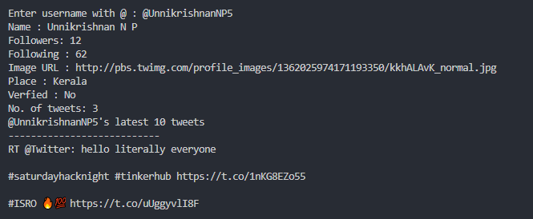

# shn_twitter_api

This is our team repo for Saturday Hacknight conducted on 16/04/2022

# About

This is a simple CLI script to get user details,no. of tweets and latest 10 tweets

# Example

# Technologies Used

- [Twitter API](https://developer.twitter.com/en/docs/twitter-api)
- [Python](https://www.python.org/doc/)
  ## Libraries used
  - [Tweepy](https://docs.tweepy.org/en/stable/)
  - [ConfigParser](https://docs.python.org/3/library/configparser.html)

# Contributors

- [Shada Fathima V](https://github.com/ShadaFathima)
- [Nikhil Krisha K](https://github.com/NIKHILKRISHNAK)
